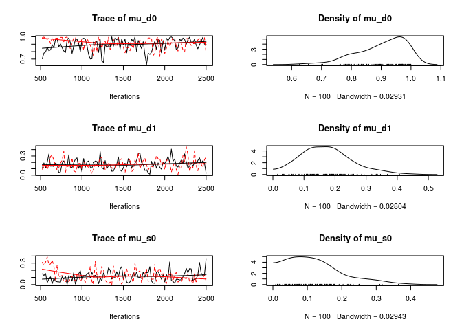
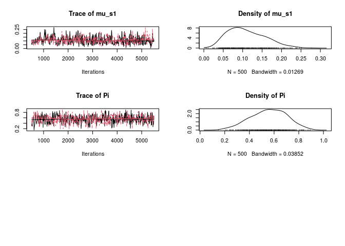

[](https://www.tidyverse.org/lifecycle/#maturing)
[](https://github.com/USCbiostats/aphylo/actions/workflows/ci.yml)
[](https://ci.appveyor.com/project/gvegayon/phylogenetic)
[](https://codecov.io/gh/USCbiostats/aphylo)
[](https://image.usc.edu)

# aphylo: Statistical Inference of Annotated Phylogenetic Trees 

The `aphylo` R package implements estimation and data imputation methods
for Functional Annotations in Phylogenetic Trees. The core function
consists on the computation of the log-likelihood of observing a given
phylogenetic tree with functional annotation on its leafs, and
probabilities associated to gain and loss of functionalities, including
probabilities of experimental misclassification. Furthermore, the
log-likelihood is computed using peeling algorithms, which required
developing and implementing efficient algorithms for re-coding and
preparing phylogenetic tree data so that can be used with the package.
Finally, `aphylo` works smoothly with popular tools for analysis of
phylogenetic data such as `ape` R package, “Analyses of Phylogenetics
and Evolution”.

The package is under MIT License, and is been developed by the Computing
and Software Cores of the Biostatistics Division’s NIH Project Grant
(P01) at the Department of Preventive Medicine at the University of
Southern California.

## Citation

``` r
citation(package="aphylo")
```


    To cite aphylo in publications use the following paper:

      Vega Yon GG, Thomas DC, Morrison J, Mi H, Thomas PD, et al. (2021)
      Bayesian parameter estimation for automatic annotation of gene
      functions using observational data and phylogenetic trees. PLOS
      Computational Biology 17(2): e1007948.
      https://doi.org/10.1371/journal.pcbi.1007948

    And the actual R package:

    Vega Yon G (2022). _Statistical Inference of Annotated Phylogenetic
    Trees_. R package version 0.2-1, <URL:
    https://github.com/USCBiostats/aphylo>.

    To see these entries in BibTeX format, use 'print(<citation>,
    bibtex=TRUE)', 'toBibtex(.)', or set
    'options(citation.bibtex.max=999)'.

## Install

This package depends on another on-development R package, the
[`fmcmc`](https://github.com/USCbiostats/fmcmc). So first you need to
install it:

``` r
devtools::install_github("USCbiostats/fmcmc")
```

Then you can install the `aphylo` package

``` r
devtools::install_github("USCbiostats/aphylo")
```

## Reading data

``` r
library(aphylo)
```

    ## Loading required package: ape

``` r
# This datasets are included in the package
data("fakeexperiment")
data("faketree")

head(fakeexperiment)
```

    ##      LeafId f1 f2
    ## [1,]      1  0  0
    ## [2,]      2  0  1
    ## [3,]      3  1  0
    ## [4,]      4  1  1

``` r
head(faketree)
```

    ##      ParentId NodeId
    ## [1,]        6      1
    ## [2,]        6      2
    ## [3,]        7      3
    ## [4,]        7      4
    ## [5,]        5      6
    ## [6,]        5      7

``` r
O <- new_aphylo(
  tip.annotation = fakeexperiment[,2:3],
  tree           = as.phylo(faketree)
)

O
```

    ## 
    ## Phylogenetic tree with 4 tips and 3 internal nodes.
    ## 
    ## Tip labels:
    ##   1, 2, 3, 4
    ## Node labels:
    ##   5, 6, 7
    ## 
    ## Rooted; no branch lengths.
    ## 
    ##  Tip (leafs) annotations:
    ##   f1 f2
    ## 1  0  0
    ## 2  0  1
    ## 3  1  0
    ## 4  1  1
    ## 
    ##  Internal node annotations:
    ##   f1 f2
    ## 5  9  9
    ## 6  9  9
    ## 7  9  9

``` r
as.phylo(O)
```

    ## 
    ## Phylogenetic tree with 4 tips and 3 internal nodes.
    ## 
    ## Tip labels:
    ##   1, 2, 3, 4
    ## Node labels:
    ##   5, 6, 7
    ## 
    ## Rooted; no branch lengths.

``` r
# We can visualize it
plot(O)
```

<!-- -->

``` r
plot_logLik(O)
```

<!-- -->

## Simulating annoated trees

``` r
set.seed(198)
dat <- raphylo(
  50,
  P    = 1, 
  psi  = c(0.05, 0.05),
  mu_d = c(0.8, 0.3),
  mu_s = c(0.1, 0.1),
  Pi   = .4
  )

dat
```

    ## 
    ## Phylogenetic tree with 50 tips and 49 internal nodes.
    ## 
    ## Tip labels:
    ##   1, 2, 3, 4, 5, 6, ...
    ## Node labels:
    ##   51, 52, 53, 54, 55, 56, ...
    ## 
    ## Rooted; no branch lengths.
    ## 
    ##  Tip (leafs) annotations:
    ##   fun0000
    ## 1       1
    ## 2       0
    ## 3       0
    ## 4       1
    ## 5       0
    ## 6       0
    ## 
    ## ...(44 obs. omitted)...
    ## 
    ## 
    ##  Internal node annotations:
    ##   fun0000
    ## 1       1
    ## 2       1
    ## 3       1
    ## 4       1
    ## 5       1
    ## 6       0
    ## 
    ## ...(43 obs. omitted)...

## Likelihood

``` r
# Parameters and data
psi     <- c(0.020,0.010)
mu_d    <- c(0.40,.10)
mu_s    <- c(0.04,.01)
eta     <- c(.7, .9)
pi_root <- .05

# Computing likelihood
str(LogLike(dat, psi = psi, mu_d = mu_d, mu_s = mu_s, eta = eta, Pi = pi_root))
```

    ## List of 2
    ##  $ Pr:List of 1
    ##   ..$ : num [1:99, 1:2] 0.018 0.686 0.686 0.018 0.686 0.686 0.018 0.018 0.018 0.686 ...
    ##  $ ll: num -40.4

# Estimation

``` r
# Using L-BFGS-B (MLE) to get an initial guess
ans0 <- aphylo_mle(dat ~ psi + mu_d + Pi + eta)


# MCMC method
ans2 <- aphylo_mcmc(
  dat ~ mu_d + mu_s + Pi,
  prior   = bprior(c(9, 1, 1, 1, 5), c(1, 9, 9, 9, 5)),
  control = list(nsteps=5e3, burnin=500, thin=10, nchains=2))
```

    ## Warning: While using multiple chains, a single initial point has been passed via
    ## `initial`: c(0.9, 0.5, 0.1, 0.05, 0.5). The values will be recycled. Ideally you
    ## would want to start each chain from different locations.

    ## Convergence has been reached with 5500 steps. Gelman-Rubin's R: 1.0434. (500 final count of samples).

``` r
ans2
```

    ## 
    ## ESTIMATION OF ANNOTATED PHYLOGENETIC TREE
    ## 
    ##  Call: aphylo_mcmc(model = dat ~ mu_d + mu_s + Pi, priors = bprior(c(9, 
    ##     1, 1, 1, 5), c(1, 9, 9, 9, 5)), control = list(nsteps = 5000, 
    ##     burnin = 500, thin = 10, nchains = 2))
    ##  LogLik (unnormalized): -20.0975 
    ##  Method used: mcmc (5500 steps)
    ##  # of Leafs: 50
    ##  # of Functions 1
    ##  # of Trees: 1
    ## 
    ##          Estimate  Std. Err.
    ##  mu_d0   0.9123    0.0727
    ##  mu_d1   0.1657    0.0779
    ##  mu_s0   0.1137    0.0743
    ##  mu_s1   0.0984    0.0431
    ##  Pi      0.5331    0.1510

``` r
plot(
  ans2,
  nsample = 200,
  loo     = TRUE,
  ncores  = 2L
  )
```

<!-- -->

``` r
# MCMC Diagnostics with coda
library(coda)
gelman.diag(ans2$hist)
```

    ## Potential scale reduction factors:
    ## 
    ##       Point est. Upper C.I.
    ## mu_d0      1.014       1.06
    ## mu_d1      1.032       1.12
    ## mu_s0      0.999       1.00
    ## mu_s1      1.003       1.01
    ## Pi         1.014       1.07
    ## 
    ## Multivariate psrf
    ## 
    ## 1.04

``` r
plot(ans2$hist)
```

<!-- --><!-- -->

# Prediction

``` r
pred <- prediction_score(ans2, loo = TRUE)
pred
```

    ## Prediction score (H0: Observed = Random)
    ## 
    ##  N obs.      : 99
    ##  alpha(0, 1) : 0.24, 0.73
    ##  Observed    : 0.71 
    ##  Random      : 0.61 
    ##  P(<t)       : 0.1539
    ## --------------------------------------------------------------------------------
    ## Values scaled to range between 0 and 1, 1 being best.
    ## 
    ## Significance levels: *** p < .01, ** p < .05, * p < .10
    ## AUC 0.78.
    ## MAE 0.29.

``` r
plot(pred)
```

<!-- -->

# Misc

During the development process, we decided to allow the user to choose
what ‘tree-reader’ function he would use, in particular, between using
either the rncl R package or ape. For such we created a short benchmark
that compares both functions
[here](playground/ape_now_supports_singletons.md).
