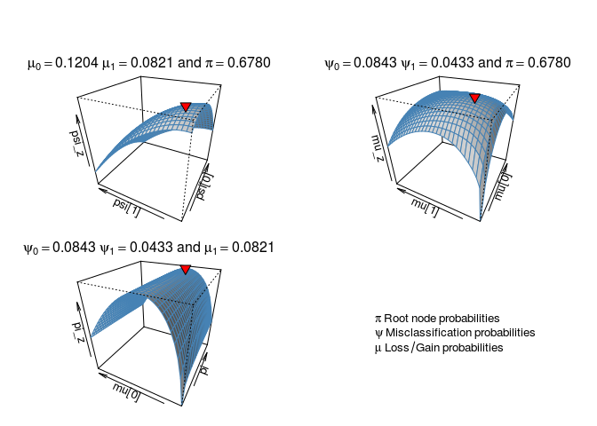
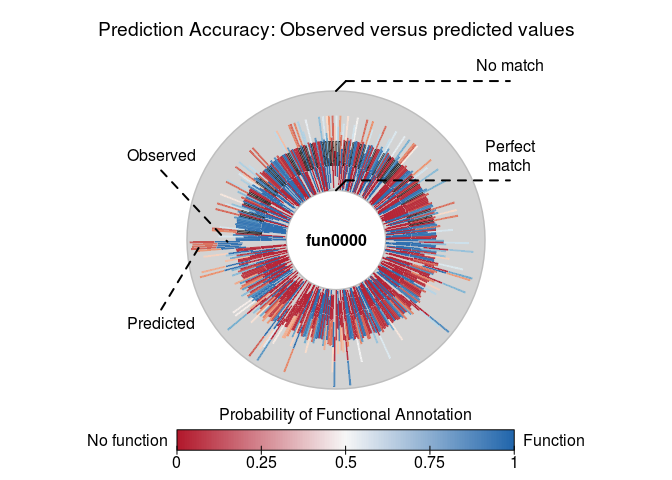
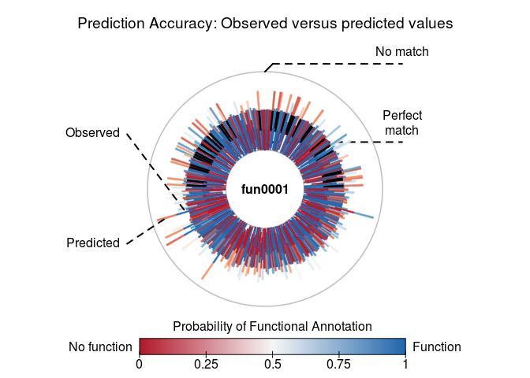

aphylo: Statistical Inference of Annotated Phylogenetic Trees
================

[](https://travis-ci.org/USCbiostats/aphylo) [](https://ci.appveyor.com/project/gvegayon/phylogenetic) [](https://codecov.io/gh/USCbiostats/aphylo)

The `aphylo` R package implements estimation and data imputation methods for Functional Annotations in Phylogenetic Trees. The core function consists on the computation of the log-likelihood of observing a given phylogenetic tree with functional annotation on its leafs, and probabilities associated to gain and loss of functionalities, including probabilities of experimental misclassification. Furthermore, the log-likelihood is computed using peeling algorithms, which required developing and implementing efficient algorithms for re-coding and preparing phylogenetic tree data so that can be used with the package. Finally, `aphylo` works smoothly with popular tools for analysis of phylogenetic data such as `ape` R package, "Analyses of Phylogenetics and Evolution".

The package is under MIT License, and is been developed by the Computing and Software Cores of the Biostatistics Division's NIH Project Grant (P01) at the Department of Preventive Medicine at the University of Southern California.

Install
-------

This package depends on another on-development R package, the [`amcmc`](https://github.com/USCbiostats/amcmc). So first you need to install it:

``` r
devtools::install_github("USCbiostats/amcmc")
```

Then you can install the `aphylo` package

``` r
devtools::install_github("USCbiostats/aphylo")
```

Reading data
------------

``` r
library(aphylo)
```

    ## Loading required package: ape

``` r
# This datasets are included in the package
data("fakeexperiment")
data("faketree")

head(fakeexperiment)
```

    ##      LeafId f1 f2
    ## [1,]      1  0  0
    ## [2,]      2  0  1
    ## [3,]      3  1  0
    ## [4,]      4  1  1

``` r
head(faketree)
```

    ##      ParentId NodeId
    ## [1,]        6      1
    ## [2,]        6      2
    ## [3,]        7      3
    ## [4,]        7      4
    ## [5,]        5      6
    ## [6,]        5      7

``` r
O <- new_aphylo(
  tip.annotation = fakeexperiment[,2:3],
  tree           = faketree
)

O
```

    ## 
    ## Phylogenetic tree with 4 tips and 3 internal nodes.
    ## 
    ## Tip labels:
    ## [1] 1 2 3 4
    ## Node labels:
    ## [1] 5 6 7
    ## 
    ## Rooted; no branch lengths.
    ## 
    ##  Tip (leafs) annotations:
    ##   f1 f2
    ## 1  0  0
    ## 2  0  1
    ## 3  1  0
    ## 4  1  1
    ## 
    ##  Internal node annotations:
    ##   f1 f2
    ## 5  9  9
    ## 6  9  9
    ## 7  9  9

``` r
as.phylo(O)
```

    ## 
    ## Phylogenetic tree with 4 tips and 3 internal nodes.
    ## 
    ## Tip labels:
    ## [1] 1 2 3 4
    ## Node labels:
    ## [1] 5 6 7
    ## 
    ## Rooted; no branch lengths.

``` r
# We can visualize it
plot(O)
```

    ## Scale for 'fill' is already present. Adding another scale for 'fill',
    ## which will replace the existing scale.


``` r
plot_LogLike(O)
```


Simulating annoated trees
-------------------------

``` r
set.seed(198)
dat <- sim_annotated_tree(
  200, P=2, 
  psi = c(0.05, 0.05),
  mu  = c(0.1, 0.1),
  eta = c(.7, .95),
  Pi  = .4
  )

dat
```

    ## 
    ## Phylogenetic tree with 200 tips and 199 internal nodes.
    ## 
    ## Tip labels:
    ##  1, 2, 3, 4, 5, 6, ...
    ## Node labels:
    ##  201, 202, 203, 204, 205, 206, ...
    ## 
    ## Rooted; no branch lengths.
    ## 
    ##  Tip (leafs) annotations:
    ##      fun0000 fun0001
    ## [1,]       1       1
    ## [2,]       0       1
    ## [3,]       0       9
    ## [4,]       1       1
    ## [5,]       1       1
    ## [6,]       1       1
    ## 
    ## ...(194 obs. omitted)...
    ## 
    ## 
    ##  Internal node annotations:
    ##      fun0000 fun0001
    ## [1,]       1       0
    ## [2,]       1       0
    ## [3,]       1       1
    ## [4,]       1       1
    ## [5,]       1       1
    ## [6,]       0       1
    ## 
    ## ...(193 obs. omitted)...

Likelihood
----------

``` r
# Parameters and data
psi     <- c(0.020,0.010)
mu      <- c(0.04,.01)
eta     <- c(.7, .9)
pi_root <- .05

# Computing likelihood
str(LogLike(dat, psi = psi, mu = mu, eta = eta, Pi = pi_root))
```

    ## List of 3
    ##  $ S : int [1:4, 1:2] 0 1 0 1 0 0 1 1
    ##  $ Pr: num [1:399, 1:4] 0.000324 0.012348 0.203056 0.000324 0.000324 ...
    ##  $ ll: num -426
    ##  - attr(*, "class")= chr "phylo_LogLik"

Estimation
==========

``` r
# Using L-BFGS-B (MLE) to get an initial guess
ans0 <- aphylo_mle(dat)


# MCMC method
ans2 <- aphylo_mcmc(
  dat,
  prior = function(p) dbeta(p, 2,20),
  control = list(nbatch=1e4, burnin=100, thin=20, nchains=5))
ans2
```

    ## 
    ## ESTIMATION OF ANNOTATED PHYLOGENETIC TREE
    ## ll: -425.9909,
    ## Method used: mcmc (10000 iterations)
    ## Leafs
    ##  # of Functions 2
    ## 
    ##          Estimate  Std. Error
    ##  psi[0]    0.0869      0.0464
    ##  psi[1]    0.0427      0.0267
    ##  mu[0]     0.1194      0.0242
    ##  mu[1]     0.0821      0.0240
    ##  eta[0]    0.6787      0.0365
    ##  eta[1]    0.7981      0.0329
    ##  Pi        0.0959      0.0707

``` r
plot(ans2)
```



``` r
# MCMC Diagnostics with coda
library(coda)
gelman.diag(ans2$hist)
```

    ## Potential scale reduction factors:
    ## 
    ##      Point est. Upper C.I.
    ## psi0       1.01       1.03
    ## psi1       1.00       1.01
    ## mu0        1.01       1.03
    ## mu1        1.00       1.01
    ## eta0       1.02       1.04
    ## eta1       1.01       1.02
    ## Pi         1.10       1.25
    ## 
    ## Multivariate psrf
    ## 
    ## 1.08

``` r
summary(ans2$hist)
```

    ## 
    ## Iterations = 120:10000
    ## Thinning interval = 20 
    ## Number of chains = 5 
    ## Sample size per chain = 495 
    ## 
    ## 1. Empirical mean and standard deviation for each variable,
    ##    plus standard error of the mean:
    ## 
    ##         Mean      SD  Naive SE Time-series SE
    ## psi0 0.08688 0.04638 0.0009323      0.0025189
    ## psi1 0.04267 0.02673 0.0005373      0.0009619
    ## mu0  0.11944 0.02421 0.0004867      0.0008335
    ## mu1  0.08211 0.02404 0.0004832      0.0007673
    ## eta0 0.67870 0.03649 0.0007334      0.0015357
    ## eta1 0.79810 0.03285 0.0006603      0.0012248
    ## Pi   0.09589 0.07071 0.0014212      0.0060563
    ## 
    ## 2. Quantiles for each variable:
    ## 
    ##         2.5%     25%     50%     75%  97.5%
    ## psi0 0.01449 0.05231 0.08139 0.11536 0.1951
    ## psi1 0.00618 0.02222 0.03736 0.05818 0.1045
    ## mu0  0.07346 0.10288 0.11855 0.13561 0.1677
    ## mu1  0.03870 0.06469 0.08051 0.09866 0.1321
    ## eta0 0.60648 0.65380 0.67969 0.70407 0.7495
    ## eta1 0.73220 0.77694 0.79815 0.82152 0.8574
    ## Pi   0.01183 0.04504 0.07958 0.12451 0.2991

Prediction
==========

``` r
pred <- prediction_score(ans2)
pred
```

    ## PREDICTION SCORE: ANNOTATED PHYLOGENETIC TREE
    ## Observed : 0.01 
    ## Random   : 0.37 
    ## ---------------------------------------------------------------------------
    ## Values scaled to range between 0 and 1, 0 being best.

``` r
plot(pred)
```



Misc
====

During the development process, we decided to allow the user to choose what 'tree-reader' function he would use, in particular, between using either the rncl R package or ape. For such we created a short benchmark that compares both functions [here](playground/ape_now_supports_singletons.md).
