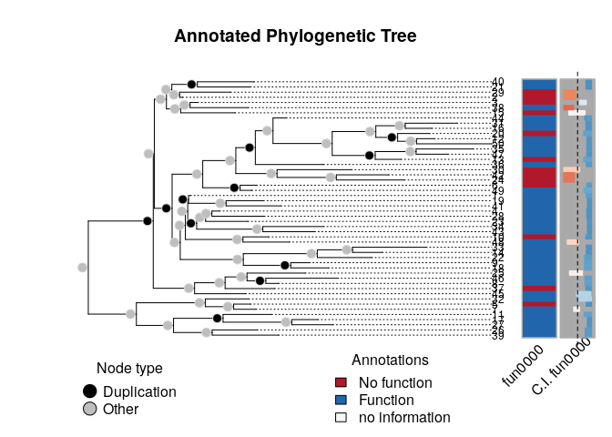
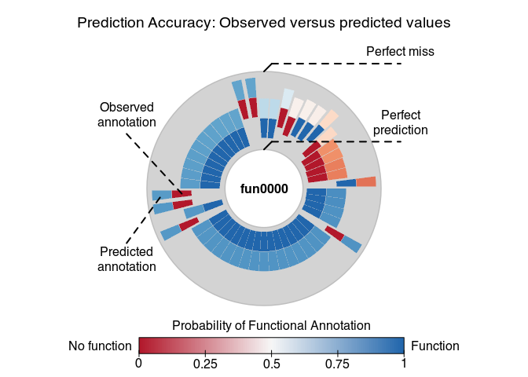
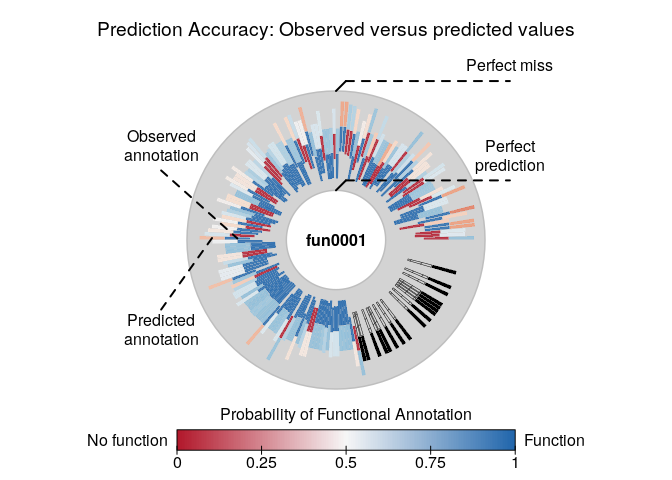

aphylo: Statistical Inference of Annotated Phylogenetic Trees
================

[](https://travis-ci.org/USCbiostats/aphylo)
[](https://ci.appveyor.com/project/gvegayon/phylogenetic)
[](https://codecov.io/gh/USCbiostats/aphylo)

The `aphylo` R package implements estimation and data imputation methods
for Functional Annotations in Phylogenetic Trees. The core function
consists on the computation of the log-likelihood of observing a given
phylogenetic tree with functional annotation on its leafs, and
probabilities associated to gain and loss of functionalities, including
probabilities of experimental misclassification. Furthermore, the
log-likelihood is computed using peeling algorithms, which required
developing and implementing efficient algorithms for re-coding and
preparing phylogenetic tree data so that can be used with the package.
Finally, `aphylo` works smoothly with popular tools for analysis of
phylogenetic data such as `ape` R package, “Analyses of Phylogenetics
and Evolution”.

The package is under MIT License, and is been developed by the Computing
and Software Cores of the Biostatistics Division’s NIH Project Grant
(P01) at the Department of Preventive Medicine at the University of
Southern California.

## Install

This package depends on another on-development R package, the
[`amcmc`](https://github.com/USCbiostats/amcmc). So first you need to
install it:

``` r
devtools::install_github("USCbiostats/amcmc")
```

Then you can install the `aphylo` package

``` r
devtools::install_github("USCbiostats/aphylo")
```

## Reading data

``` r
library(aphylo)
```

    ## Loading required package: ape

``` r
# This datasets are included in the package
data("fakeexperiment")
data("faketree")

head(fakeexperiment)
```

    ##      LeafId f1 f2
    ## [1,]      1  0  0
    ## [2,]      2  0  1
    ## [3,]      3  1  0
    ## [4,]      4  1  1

``` r
head(faketree)
```

    ##      ParentId NodeId
    ## [1,]        6      1
    ## [2,]        6      2
    ## [3,]        7      3
    ## [4,]        7      4
    ## [5,]        5      6
    ## [6,]        5      7

``` r
O <- new_aphylo(
  tip.annotation = fakeexperiment[,2:3],
  tree           = faketree
)

O
```

    ## 
    ## Phylogenetic tree with 4 tips and 3 internal nodes.
    ## 
    ## Tip labels:
    ## [1] 1 2 3 4
    ## Node labels:
    ## [1] 5 6 7
    ## 
    ## Rooted; no branch lengths.
    ## 
    ##  Tip (leafs) annotations:
    ##   f1 f2
    ## 1  0  0
    ## 2  0  1
    ## 3  1  0
    ## 4  1  1
    ## 
    ##  Internal node annotations:
    ##   f1 f2
    ## 5  9  9
    ## 6  9  9
    ## 7  9  9

``` r
as.phylo(O)
```

    ## 
    ## Phylogenetic tree with 4 tips and 3 internal nodes.
    ## 
    ## Tip labels:
    ## [1] 1 2 3 4
    ## Node labels:
    ## [1] 5 6 7
    ## 
    ## Rooted; no branch lengths.

``` r
# We can visualize it
plot(O)
```

<!-- -->

``` r
plot_logLik(O)
```

    ## No parameters were specified. Default will be used instead.

<!-- -->

## Simulating annoated trees

``` r
set.seed(198)
dat <- raphylo(
  200, P=2, 
  psi = c(0.05, 0.05),
  mu  = c(0.1, 0.1),
  eta = c(.7, .95),
  Pi  = .4
  )

dat
```

    ## 
    ## Phylogenetic tree with 200 tips and 199 internal nodes.
    ## 
    ## Tip labels:
    ##  1, 2, 3, 4, 5, 6, ...
    ## Node labels:
    ##  201, 202, 203, 204, 205, 206, ...
    ## 
    ## Rooted; no branch lengths.
    ## 
    ##  Tip (leafs) annotations:
    ##      fun0000 fun0001
    ## [1,]       1       1
    ## [2,]       0       1
    ## [3,]       0       9
    ## [4,]       1       1
    ## [5,]       1       1
    ## [6,]       1       1
    ## 
    ## ...(194 obs. omitted)...
    ## 
    ## 
    ##  Internal node annotations:
    ##      fun0000 fun0001
    ## [1,]       1       0
    ## [2,]       1       0
    ## [3,]       1       1
    ## [4,]       1       1
    ## [5,]       1       1
    ## [6,]       0       1
    ## 
    ## ...(193 obs. omitted)...

## Likelihood

``` r
# Parameters and data
psi     <- c(0.020,0.010)
mu      <- c(0.04,.01)
eta     <- c(.7, .9)
pi_root <- .05

# Computing likelihood
str(LogLike(dat, psi = psi, mu = mu, eta = eta, Pi = pi_root))
```

    ## List of 3
    ##  $ S : int [1:4, 1:2] 0 1 0 1 0 0 1 1
    ##  $ Pr: num [1:399, 1:4] 0.000324 0.012348 0.203056 0.000324 0.000324 ...
    ##  $ ll: num -399
    ##  - attr(*, "class")= chr "phylo_LogLik"

# Estimation

``` r
# Using L-BFGS-B (MLE) to get an initial guess
ans0 <- aphylo_mle(dat ~ psi + mu + Pi + eta)
```

    ## No parameters were specified. Default will be used instead.

``` r
# MCMC method
ans2 <- aphylo_mcmc(
  dat ~ mu + psi + eta,
  prior = function(p) dbeta(p, 2,20),
  control = list(nsteps=1e4, burnin=100, thin=20, nchains=5))
```

    ## No parameters were specified. Default will be used instead.

    ## Warning: A single initial point has been passed via `initial`: c(0.1, 0.1,
    ## 0.1, 0.1, 0.9, 0.9). The values will be recycled.

    ## Convergence has been reached with 5100 steps (250 final count of observations).

``` r
ans2
```

    ## 
    ## ESTIMATION OF ANNOTATED PHYLOGENETIC TREE
    ## 
    ##  Call: aphylo_mcmc(model = dat ~ mu + psi + eta, priors = function(p) dbeta(p, 
    ##     2, 20), control = list(nsteps = 10000, burnin = 100, thin = 20, 
    ##     nchains = 5))
    ##  LogLik (unnormalized): -425.5212
    ##  Method used: mcmc (5100 steps)
    ##  # of Leafs: 200
    ##  # of Functions 2
    ##          Estimate  Std. Err.
    ##  psi0    0.0803    0.0429
    ##  psi1    0.0446    0.0274
    ##  mu0     0.1167    0.0252
    ##  mu1     0.0931    0.0228
    ##  eta0    0.6811    0.0365
    ##  eta1    0.7965    0.0339

``` r
plot(ans2)
```

<!-- -->

``` r
# MCMC Diagnostics with coda
library(coda)
gelman.diag(ans2$hist)
```

    ## Potential scale reduction factors:
    ## 
    ##      Point est. Upper C.I.
    ## psi0       1.01       1.02
    ## psi1       1.00       1.01
    ## mu0        1.00       1.00
    ## mu1        1.00       1.01
    ## eta0       1.03       1.09
    ## eta1       1.01       1.03
    ## 
    ## Multivariate psrf
    ## 
    ## 1.04

``` r
summary(ans2$hist)
```

    ## 
    ## Iterations = 120:5100
    ## Thinning interval = 20 
    ## Number of chains = 5 
    ## Sample size per chain = 250 
    ## 
    ## 1. Empirical mean and standard deviation for each variable,
    ##    plus standard error of the mean:
    ## 
    ##         Mean      SD  Naive SE Time-series SE
    ## psi0 0.08033 0.04286 0.0012124      0.0029867
    ## psi1 0.04459 0.02744 0.0007762      0.0015877
    ## mu0  0.11666 0.02524 0.0007140      0.0013441
    ## mu1  0.09310 0.02276 0.0006438      0.0009425
    ## eta0 0.68112 0.03646 0.0010312      0.0024279
    ## eta1 0.79652 0.03393 0.0009598      0.0018961
    ## 
    ## 2. Quantiles for each variable:
    ## 
    ##          2.5%     25%     50%     75%  97.5%
    ## psi0 0.013898 0.04691 0.07651 0.10873 0.1736
    ## psi1 0.006886 0.02266 0.04104 0.05945 0.1069
    ## mu0  0.070852 0.09930 0.11505 0.13371 0.1675
    ## mu1  0.049828 0.07780 0.09273 0.10808 0.1382
    ## eta0 0.609969 0.65659 0.68127 0.70529 0.7514
    ## eta1 0.724272 0.77520 0.79825 0.82008 0.8580

# Prediction

``` r
pred <- prediction_score(ans2)
pred
```

    ## PREDICTION SCORE: ANNOTATED PHYLOGENETIC TREE
    ## Observed : 0.01 
    ## Random   : 0.42 
    ## ---------------------------------------------------------------------------
    ## Values scaled to range between 0 and 1, 0 being best.

``` r
plot(pred)
```

<!-- --><!-- -->

# Misc

During the development process, we decided to allow the user to choose
what ‘tree-reader’ function he would use, in particular, between using
either the rncl R package or ape. For such we created a short benchmark
that compares both functions
[here](playground/ape_now_supports_singletons.md).
