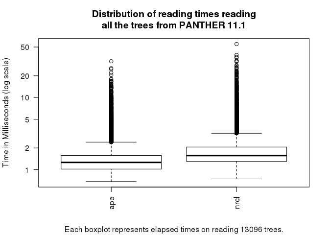

Testing the new ape R package
================
George G. Vega Yon
2017-09-07

The following document presents some results from testing the new ape::read.tree function from the ape package version 4.1.0.14. The first test consists basically on reading a tree with a singleton, which is a new feature of the package. The second tests compares the performance in terms of time that ape::read.tree takes relative to rncl::read\_newick\_phylo which has show to be significantly faster.

Data
====

The data used here is the PANTHER database version 11.1 (which you can get [here](ftp://ftp.pantherdb.org/panther_library/11.1/)). You can download a more recent version from the [pantherdb website](http://www.pantherdb.org/downloads/).

Setup
=====

We use the microbenchmark R package together with the ape and rncl R packages

Reading trees with singletons
=============================

This is a tree that I know for sure that has a singleton. Previous version of ape (before 4.1-0.14) returned with an error.

``` r
a_tree_with_singleton <- "
((((((((((((((AN14:0.000,AN15:0.000):0.000[&&NHX:Ev=0>1:S=Homo-Pan:ID=AN13],(AN17:0.000,AN18:0.000):0.000[&&NHX:Ev=0>1:S=Murinae:ID=AN16]):0.000[&&NHX:Ev=0>1:S=Euarchontoglires:ID=AN12],(AN20:0.000,AN21:0.000):0.000[&&NHX:Ev=0>1:S=Laurasiatheria:ID=AN19]):0.000[&&NHX:Ev=0>1:S=Eutheria:ID=AN11],AN22:0.004):0.003[&&NHX:Ev=0>1:S=Mammalia:ID=AN10],AN23:0.000):0.014[&&NHX:Ev=0>1:S=Amniota:ID=AN9],AN24:0.017):0.021[&&NHX:Ev=0>1:S=Tetrapoda:ID=AN8],((AN27:0.066,AN28:0.052):0.010[&&NHX:Ev=1>0:ID=AN26],(AN30:0.031,AN31:0.014):0.003[&&NHX:Ev=1>0:ID=AN29]):0.021[&&NHX:Ev=0>1:S=Teleostei:ID=AN25]):0.147[&&NHX:Ev=0>1:S=Osteichthyes:ID=AN7],AN32:0.194):0.104[&&NHX:Ev=0>1:S=Deuterostomia:ID=AN6],((AN35:0.020,AN36:0.038):0.416[&&NHX:Ev=0>1:S=Caenorhabditis:ID=AN34],((AN39:0.119,AN40:0.131):0.154[&&NHX:Ev=0>1:S=Insecta:ID=AN38],AN41:0.317):0.104[&&NHX:Ev=0>1:S=Arthropoda:ID=AN37]):0.118[&&NHX:Ev=0>1:S=Ecdysozoa:ID=AN33],AN42:0.381):0.594[&&NHX:Ev=0>1:S=Bilateria:ID=AN5],AN43:2.000):0.414[&&NHX:Ev=0>1:S=Eumetazoa:ID=AN4],((((((((AN52:0.484,AN53:0.427):0.418[&&NHX:Ev=0>1:S=Saccharomycetaceae:ID=AN51],AN54:0.733):0.320[&&NHX:Ev=0>1:S=Saccharomycetaceae-Candida:ID=AN50],AN55:0.808):0.290[&&NHX:Ev=0>1:S=Saccharomycetales:ID=AN49],(AN57:0.793,((AN60:0.206,AN61:0.186):0.143[&&NHX:Ev=0>1:S=Sordariomyceta:ID=AN59],AN62:0.331):0.332[&&NHX:Ev=0>1:S=Sordariomycetes-Leotiomycetes:ID=AN58]):0.467[&&NHX:Ev=0>1:S=Pezizomycotina:ID=AN56]):0.432[&&NHX:Ev=0>1:S=Pezizomycotina-Saccharomycotina:ID=AN48],AN63:0.864):0.223[&&NHX:Ev=0>1:S=Ascomycota:ID=AN47],(AN65:0.613,AN66:0.930,AN67:0.755):0.332[&&NHX:Ev=0>1:S=Basidiomycota:ID=AN64]):0.618[&&NHX:Ev=0>1:S=Dikarya:ID=AN46],((((((AN74:0.337,AN75:0.406):0.298[&&NHX:Ev=0>1:S=Saccharomycetaceae:ID=AN73],AN76:0.578):0.338[&&NHX:Ev=0>1:S=Saccharomycetaceae-Candida:ID=AN72],AN77:0.567):0.304[&&NHX:Ev=0>1:S=Saccharomycetales:ID=AN71],(AN79:0.379,((AN82:0.398,AN83:0.403):0.191[&&NHX:Ev=0>1:S=Sordariomyceta:ID=AN81],AN84:0.366):0.140[&&NHX:Ev=0>1:S=Sordariomycetes-Leotiomycetes:ID=AN80]):0.457[&&NHX:Ev=0>1:S=Pezizomycotina:ID=AN78]):0.331[&&NHX:Ev=0>1:S=Pezizomycotina-Saccharomycotina:ID=AN70],AN85:0.737):0.128[&&NHX:Ev=0>1:S=Ascomycota:ID=AN69],(AN87:0.599,AN88:0.698):0.161[&&NHX:Ev=0>1:S=Basidiomycota:ID=AN86]):0.398[&&NHX:Ev=0>1:S=Dikarya:ID=AN68]):0.117[&&NHX:Ev=1>0:ID=AN45],(AN90:0.984,AN91:0.893):0.158[&&NHX:Ev=1>0:ID=AN89]):0.262[&&NHX:Ev=0>1:S=Fungi:ID=AN44]):0.394[&&NHX:Ev=0>1:S=Opisthokonts:ID=AN3],(AN93:0.457,AN94:0.462):0.860[&&NHX:Ev=0>1:S=Dictyostelium:ID=AN92]):0.301[&&NHX:Ev=0>1:S=Unikonts:ID=AN2],AN95:1.440,AN96:2.000):2.000[&&NHX:Ev=0>1:S=Eukaryota:ID=AN1])[&&NHX:Ev=1>0:ID=AN0];
"

# Reading using the ape 4.1-0.14 -----------------------------------------------
ans_ape  <- ape::read.tree(text=a_tree_with_singleton)

# Reading using rncl 0.8.2 -----------------------------------------------------

# For some weird reason, rncl::read_newick_phylo prints a progress bar when
# the document is been knitted.
tmptree <- tempfile()
cat(a_tree_with_singleton, file=tmptree)
invisible(capture.output(
  ans_rncl <- rncl::read_newick_phylo(tmptree)
  ))
file.remove(tmptree)
```

    ## [1] TRUE

``` r
# APE should have an extra node
ans_ape
```

    ## 
    ## Phylogenetic tree with 50 tips and 47 internal nodes.
    ## 
    ## Tip labels:
    ##  AN14, AN15, AN17, AN18, AN20, AN21, ...
    ## 
    ## Rooted; includes branch lengths.

``` r
ans_rncl
```

    ## 
    ## Phylogenetic tree with 50 tips and 46 internal nodes.
    ## 
    ## Tip labels:
    ##  AN14, AN15, AN17, AN18, AN20, AN21, ...
    ## 
    ## Unrooted; includes branch lengths.

``` r
# Which is a singleton!
ape::has.singles(ans_ape)
```

    ## [1] TRUE

``` r
ape::has.singles(ans_rncl)
```

    ## [1] FALSE

Speed benchmark
===============

For this benchmark, we will read all 13096 phylogenetic trees available in PANTHER 11.1

``` r
# A function to (partially) read PANTHER trees
read_panther <- function(x, f) {
  x       <- readLines(x, n=1L)
  tmptree <- tempfile()
  cat(x, file=tmptree)
  ans <- f(tmptree)
  file.remove(tmptree)
  ans
}

# Checking how it works with 100 samples
set.seed(1984)
n            <- length(tree.files) # 2000
tree.samples <- sample(tree.files, n)

library(parallel)
cl <- makeForkCluster(10)

ans <- parLapply(cl, tree.samples, function(tree) {
  microbenchmark(
    ape  = read_panther(tree, ape::read.tree),
    rncl = read_panther(tree, rncl::read_newick_phylo),
    times = 1, unit = "ms"
  )
})
stopCluster(cl)

tab <- lapply(ans, function(x) {
  # A bad way of reshaping the data...
  with(x, data.frame(
    ape  = time[expr == "ape"],
    nrcl = time[expr == "rncl"]
    ))
})

tab <- do.call(rbind, tab)
```



While `ape` seems to be faster, it is not **significantly** faster than `rncl`.

Session info
============

``` r
devtools::session_info()
```

    ##  setting  value                       
    ##  version  R version 3.4.1 (2017-06-30)
    ##  system   x86_64, linux-gnu           
    ##  ui       X11                         
    ##  language (EN)                        
    ##  collate  en_US.UTF-8                 
    ##  tz       America/New_York            
    ##  date     2017-09-07                  
    ## 
    ##  package        * version  date       source        
    ##  ape              4.1-0.14 2017-09-07 local         
    ##  assertthat       0.2.0    2017-04-11 CRAN (R 3.4.0)
    ##  backports        1.1.0    2017-05-22 CRAN (R 3.4.0)
    ##  base           * 3.4.1    2017-06-30 local         
    ##  colorspace       1.3-2    2016-12-14 CRAN (R 3.4.0)
    ##  compiler         3.4.1    2017-06-30 local         
    ##  datasets       * 3.4.1    2017-06-30 local         
    ##  devtools         1.13.3   2017-08-02 CRAN (R 3.4.0)
    ##  digest           0.6.12   2017-01-27 CRAN (R 3.4.0)
    ##  evaluate         0.10.1   2017-06-24 CRAN (R 3.4.0)
    ##  ggplot2          2.2.1    2016-12-30 CRAN (R 3.4.0)
    ##  graphics       * 3.4.1    2017-06-30 local         
    ##  grDevices      * 3.4.1    2017-06-30 local         
    ##  grid             3.4.1    2017-06-30 local         
    ##  gtable           0.2.0    2016-02-26 CRAN (R 3.4.0)
    ##  htmltools        0.3.6    2017-04-28 CRAN (R 3.4.0)
    ##  knitr            1.17     2017-08-10 CRAN (R 3.4.0)
    ##  lattice          0.20-35  2017-03-25 CRAN (R 3.4.1)
    ##  lazyeval         0.2.0    2016-06-12 CRAN (R 3.4.0)
    ##  magrittr         1.5      2014-11-22 CRAN (R 3.4.0)
    ##  memoise          1.1.0    2017-04-21 CRAN (R 3.4.0)
    ##  methods        * 3.4.1    2017-06-30 local         
    ##  microbenchmark * 1.4-2.1  2015-11-25 CRAN (R 3.4.0)
    ##  munsell          0.4.3    2016-02-13 CRAN (R 3.4.0)
    ##  nlme             3.1-131  2017-02-06 CRAN (R 3.4.1)
    ##  parallel         3.4.1    2017-06-30 local         
    ##  plyr             1.8.4    2016-06-08 CRAN (R 3.4.0)
    ##  prettyunits      1.0.2    2015-07-13 CRAN (R 3.4.1)
    ##  progress         1.1.2    2016-12-14 CRAN (R 3.4.1)
    ##  R6               2.2.2    2017-06-17 CRAN (R 3.4.0)
    ##  Rcpp             0.12.12  2017-07-15 CRAN (R 3.4.0)
    ##  rlang            0.1.2    2017-08-09 CRAN (R 3.4.0)
    ##  rmarkdown        1.6      2017-06-15 CRAN (R 3.4.0)
    ##  rncl             0.8.2    2016-12-16 CRAN (R 3.4.1)
    ##  rprojroot        1.2      2017-01-16 CRAN (R 3.4.0)
    ##  scales           0.5.0    2017-08-24 CRAN (R 3.4.0)
    ##  stats          * 3.4.1    2017-06-30 local         
    ##  stringi          1.1.5    2017-04-07 CRAN (R 3.4.0)
    ##  stringr          1.2.0    2017-02-18 CRAN (R 3.4.0)
    ##  tibble           1.3.4    2017-08-22 CRAN (R 3.4.0)
    ##  tools            3.4.1    2017-06-30 local         
    ##  utils          * 3.4.1    2017-06-30 local         
    ##  withr            2.0.0    2017-07-28 CRAN (R 3.4.0)
    ##  yaml             2.1.14   2016-11-12 CRAN (R 3.4.0)
