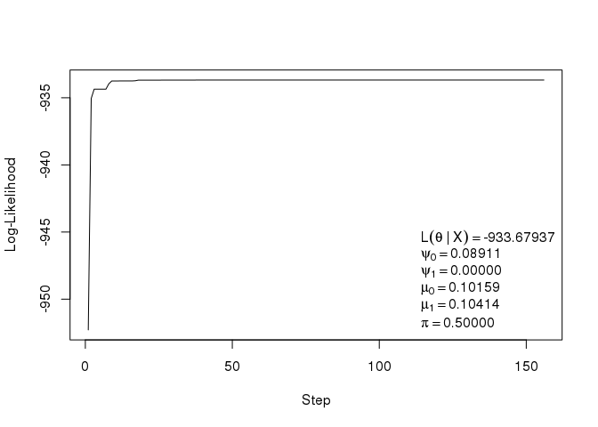

Phylogenetic tree
================

[](https://travis-ci.org/gvegayon/phylogenetic) [](https://ci.appveyor.com/project/USCbiostats/phylogenetic) [](https://codecov.io/github/gvegayon/phylogenetic?branch=master)

Install
-------

Using devtools

``` r
devtools::install_github("gvegayon/phylogenetic")
```

Example
-------

``` r
library(phylogenetic)
```

``` r
# This datasets are included in the package
data("experiment")
data("tree")

head(experiment)
```

    ##   f01 f02 f03 LeafId
    ## 1   9   9   1     16
    ## 2   9   9   9     20
    ## 3   9   1   9     21
    ## 4   9   9   9     34
    ## 5   9   9   9     39
    ## 6   9   9   9     50

``` r
head(tree)
```

    ##   NodeId TypeId ParentId
    ## 1      2      0        0
    ## 2      6      1        2
    ## 3      7      0        6
    ## 4      9      0        7
    ## 5     13      0        9
    ## 6     16      2       13

``` r
O <- get_offspring(
    experiment, "LeafId", 
    tree, "NodeId", "ParentId"
)

# There is no nice print method for now
lapply(O, head)
```

    ## $experiment
    ##      [,1] [,2] [,3]
    ## [1,]    9    9    9
    ## [2,]    9    9    9
    ## [3,]    9    9    9
    ## [4,]    9    9    9
    ## [5,]    9    9    9
    ## [6,]    9    9    9
    ## 
    ## $fun_names
    ## [1] "f01" "f02" "f03"
    ## 
    ## $added
    ## [1] TRUE TRUE TRUE TRUE TRUE TRUE
    ## 
    ## $offspring
    ## $offspring[[1]]
    ## [1]   1  68 232
    ## 
    ## $offspring[[2]]
    ## [1]  2 61
    ## 
    ## $offspring[[3]]
    ## [1]  3 12 29 43
    ## 
    ## $offspring[[4]]
    ## [1]  4 11
    ## 
    ## $offspring[[5]]
    ## [1]  5 10
    ## 
    ## $offspring[[6]]
    ## [1] 6 7
    ## 
    ## 
    ## $noffspring
    ## [1] 3 2 4 2 2 2
    ## 
    ## $edgelist
    ##      NodeId ParentId
    ## [1,]      2        0
    ## [2,]      6        2
    ## [3,]      7        6
    ## [4,]      9        7
    ## [5,]     13        9
    ## [6,]     16       13

``` r
# We can visualize it
plot(O, vertex.size = 5, vertex.label = NA)
```


``` r
plot_LogLike(O)
```


Likelihood
----------

``` r
# Parameters and data

psi     <- c(0.020,0.010)
mu      <- c(0.004,.001)
pi_root <- c(1-0.1,.1)

# Computing likelihood
ll1   <- LogLike(O$experiment, O$offspring, O$noffspring, psi, mu, pi_root)
lapply(ll1, head)
```

    ## $S
    ##      [,1] [,2] [,3]
    ## [1,]    0    0    0
    ## [2,]    1    0    0
    ## [3,]    0    1    0
    ## [4,]    1    1    0
    ## [5,]    0    0    1
    ## [6,]    1    0    1
    ## 
    ## $PI
    ##       [,1]
    ## [1,] 0.729
    ## [2,] 0.081
    ## [3,] 0.081
    ## [4,] 0.009
    ## [5,] 0.081
    ## [6,] 0.009
    ## 
    ## $PSI
    ##      [,1] [,2] [,3] [,4] [,5] [,6] [,7] [,8]
    ## [1,]    1    1    1    1    1    1    1    1
    ## [2,]    1    1    1    1    1    1    1    1
    ## [3,]    1    1    1    1    1    1    1    1
    ## [4,]    1    1    1    1    1    1    1    1
    ## [5,]    1    1    1    1    1    1    1    1
    ## [6,]    1    1    1    1    1    1    1    1
    ## 
    ## $Pr
    ##              [,1]         [,2]         [,3]         [,4]         [,5]
    ## [1,] 2.907936e-14 5.656550e-13 5.541133e-08 1.077867e-06 1.671195e-08
    ## [2,] 4.607727e-07 4.607727e-07 1.145321e-04 1.145321e-04 3.551448e-03
    ## [3,] 8.797451e-10 8.797451e-10 4.596326e-05 4.596326e-05 1.715134e-05
    ## [4,] 1.118125e-03 1.118125e-03 3.114446e-02 3.114446e-02 3.494744e-02
    ## [5,] 8.761008e-04 8.761008e-04 2.738287e-02 2.738287e-02 3.120496e-02
    ## [6,] 6.624455e-04 6.624455e-04 2.359499e-02 2.359499e-02 2.743629e-02
    ##              [,6]       [,7]      [,8]
    ## [1,] 3.250828e-07 0.03184498 0.6194522
    ## [2,] 3.551448e-03 0.88276702 0.8827670
    ## [3,] 1.715134e-05 0.89609066 0.8960907
    ## [4,] 3.494744e-02 0.97343214 0.9734321
    ## [5,] 3.120496e-02 0.97532329 0.9753233
    ## [6,] 2.743629e-02 0.97722578 0.9772258
    ## 
    ## $ll
    ## [1] -155.486

MLE estimation
==============

``` r
ans0 <- mle(rep(.5,5), O)

# Plotting the path
ans0$par
```

    ##         psi0         psi1          mu0          mu1           Pi 
    ## 1.000000e+00 1.243107e-08 2.832195e-01 2.831727e-01 5.000000e-01

``` r
ans0$value
```

    ## [1] -149.3494

``` r
plot(ans0)
```


