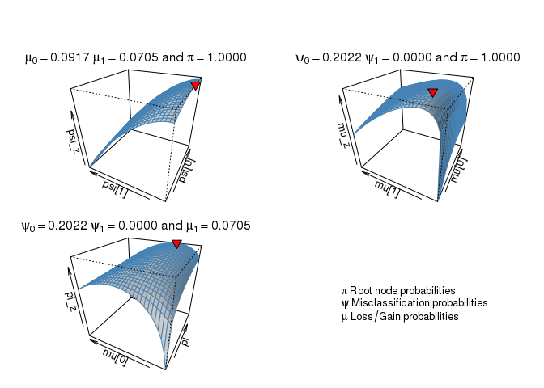
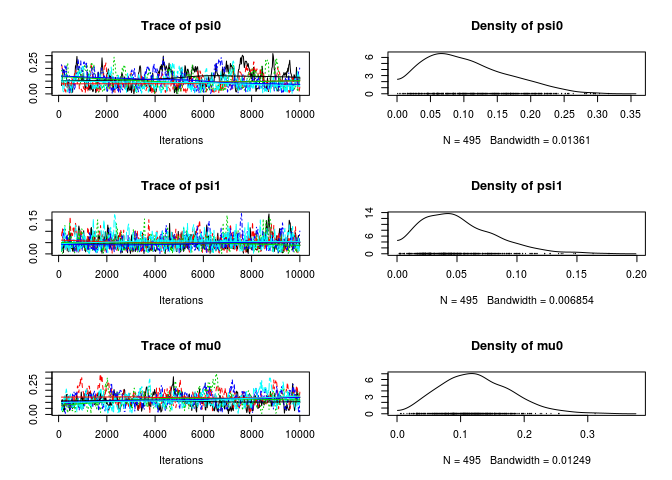
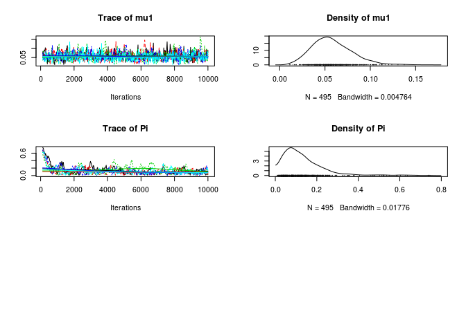

aphylo: Statistical Inference of Annotated Phylogenetic Trees
================

[](https://travis-ci.org/USCbiostats/aphylo) [](https://ci.appveyor.com/project/USCbiostats/aphylo) [](https://codecov.io/github/USCbiostats/aphylo?branch=master)

The `aphylo` R package implements estimation and data imputation methods for Functional Annotations in Phylogenetic Trees. The core function consists on the computation of the log-likelihood of observing a given phylogenetic tree with functional annotation on its leafs, and probabilities associated to gain and loss of functionalities, including probabilities of experimental misclassification. Furthermore, the log-likelihood is computed using peeling algorithms, which required developing and implementing efficient algorithms for re-coding and preparing phylogenetic tree data so that can be used with the package. Finally, `aphylo` works smoothly with popular tools for analysis of phylogenetic data such as `ape` R package, "Analyses of Phylogenetics and Evolution".

The package is under MIT License, and is been developed by the Computing and Software Cores of the Biostatistics Division's NIH Project Grant (P01) at the Department of Preventive Medicine at the University of Southern California.

Install
-------

This package depends on another on-development R package, the [`amcmc`](https://github.com/USCbiostats/amcmc). So first you need to install it:

``` r
devtools::install_github("USCbiostats/amcmc")
```

Then you can install the `aphylo` package

``` r
devtools::install_github("USCbiostats/aphylo")
```

Reading data
------------

``` r
library(aphylo)
```

``` r
# This datasets are included in the package
data("fakeexperiment")
data("faketree")

head(fakeexperiment)
```

    ##   LeafId f1 f2
    ## 1      3  0  0
    ## 2      4  0  1
    ## 3      5  1  0
    ## 4      6  1  1

``` r
head(faketree)
```

    ##      ParentId NodeId
    ## [1,]        1      3
    ## [2,]        1      4
    ## [3,]        2      5
    ## [4,]        2      6
    ## [5,]        0      1
    ## [6,]        0      2

``` r
O <- new_aphylo(
  annotations = fakeexperiment,
  edges       = faketree
)

# There is no nice print method for now
as.apephylo(O)
```

    ## 
    ## Phylogenetic tree with 4 tips and 3 internal nodes.
    ## 
    ## Tip labels:
    ## [1] "3" "4" "5" "6"
    ## Node labels:
    ## [1] "0" "1" "2"
    ## 
    ## Rooted; includes branch lengths.

``` r
# We can visualize it
plot(O)
```


``` r
plot_LogLike(O)
```


Simulating annoated trees
-------------------------

``` r
set.seed(1958)
dat <- sim_annotated_tree(
  100, P=1, 
  psi = c(0.05, 0.05),
  mu  = c(0.1, 0.05),
  Pi  = 1
  )

as.apephylo(dat)
```

    ## 
    ## Phylogenetic tree with 100 tips and 99 internal nodes.
    ## 
    ## Tip labels:
    ##  164, 168, 109, 110, 175, 171, ...
    ## Node labels:
    ##  0, 98, 97, 96, 95, 94, ...
    ## 
    ## Rooted; includes branch lengths.

Likelihood
----------

``` r
# Parameters and data
psi     <- c(0.020,0.010)
mu      <- c(0.04,.01)
pi_root <- .999

# Computing likelihood
with(dat, 
     LogLike(
       annotations = annotations, 
       offspring   = offspring, 
       noffspring  = noffspring, 
       psi = psi, mu = mu, Pi = pi_root)
)
```

    ## $ll
    ## [1] -57.35087
    ## 
    ## attr(,"class")
    ## [1] "phylo_LogLik"

Estimation
==========

``` r
# Using L-BFGS-B (MLE)
(ans0 <- phylo_mle(dat))
```

    ## ESTIMATION OF ANNOTATED PHYLOGENETIC TREE
    ## ll:  -46.9586,
    ## Method used: L-BFGS-B (39 iterations)
    ## convergence: 0 (see ?optim)
    ## Leafs
    ##  # of Functions 1
    ##  # of 0:    25 (25%)
    ##  # of 1:    75 (75%)
    ## 
    ##          Estimate  Std. Error
    ##  psi[0]    0.2022      0.2499
    ##  psi[1]    0.0000      0.0609
    ##  mu[0]     0.0917      0.1366
    ##  mu[1]     0.0705      0.0382
    ##  Pi        1.0000      1.0702

``` r
# Plotting loglike
plot_LogLike(ans0)
```



``` r
# Using ABC (MLE)
(ans1 <- phylo_mle(dat, method="ABC"))
```

    ## ESTIMATION OF ANNOTATED PHYLOGENETIC TREE
    ## ll:  -46.9605,
    ## Method used: ABC (119 iterations)
    ## Leafs
    ##  # of Functions 1
    ##  # of 0:    25 (25%)
    ##  # of 1:    75 (75%)
    ## 
    ##          Estimate  Std. Error
    ##  psi[0]    0.1869      0.2542
    ##  psi[1]    0.0000      0.0613
    ##  mu[0]     0.0991      0.1380
    ##  mu[1]     0.0699      0.0380
    ##  Pi        1.0000      1.0798

``` r
# MCMC method
ans2 <- phylo_mcmc(
  ans0$par, dat,
  prior = function(p) dbeta(p, 2,20),
  control = list(nbatch=1e4, burnin=100, thin=20, nchains=5))
ans2
```

    ## ESTIMATION OF ANNOTATED PHYLOGENETIC TREE
    ## ll:  -42.7479,
    ## Method used: mcmc (10000 iterations)
    ## Leafs
    ##  # of Functions 1
    ##  # of 0:    25 (25%)
    ##  # of 1:    75 (75%)
    ## 
    ##          Estimate  Std. Error
    ##  psi[0]    0.1092      0.0650
    ##  psi[1]    0.0496      0.0296
    ##  mu[0]     0.1234      0.0569
    ##  mu[1]     0.0588      0.0227
    ##  Pi        0.1393      0.1090

``` r
# MCMC Diagnostics with coda
library(coda)
gelman.diag(ans2$hist)
```

    ## Potential scale reduction factors:
    ## 
    ##      Point est. Upper C.I.
    ## psi0       1.07       1.18
    ## psi1       1.01       1.03
    ## mu0        1.05       1.13
    ## mu1        1.00       1.01
    ## Pi         1.21       1.49
    ## 
    ## Multivariate psrf
    ## 
    ## 1.17

``` r
summary(ans2$hist)
```

    ## 
    ## Iterations = 120:10000
    ## Thinning interval = 20 
    ## Number of chains = 5 
    ## Sample size per chain = 495 
    ## 
    ## 1. Empirical mean and standard deviation for each variable,
    ##    plus standard error of the mean:
    ## 
    ##         Mean      SD  Naive SE Time-series SE
    ## psi0 0.10917 0.06502 0.0013070      0.0046768
    ## psi1 0.04960 0.02959 0.0005948      0.0010528
    ## mu0  0.12339 0.05690 0.0011438      0.0034039
    ## mu1  0.05876 0.02266 0.0004556      0.0006983
    ## Pi   0.13927 0.10897 0.0021903      0.0102248
    ## 
    ## 2. Quantiles for each variable:
    ## 
    ##          2.5%     25%     50%     75%  97.5%
    ## psi0 0.015696 0.05897 0.09805 0.15079 0.2541
    ## psi1 0.006994 0.02720 0.04467 0.06644 0.1197
    ## mu0  0.030326 0.08157 0.11899 0.16014 0.2497
    ## mu1  0.022568 0.04296 0.05566 0.07199 0.1090
    ## Pi   0.017302 0.06655 0.11554 0.18080 0.4659

``` r
plot(ans2$hist)
```


